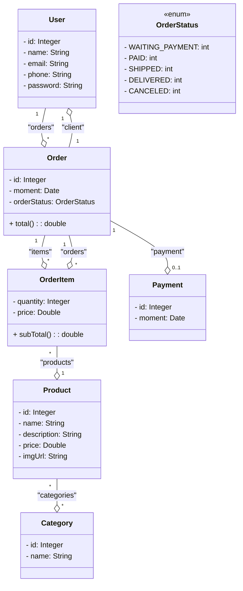

Workshop criado com base na aula de Spring Boot do curso Java Completo - Nélio Alves. Estou fazendo melhorias e implementações mais robustas, como tratamento de exceções, endpoints concisos, utilização de containers do Docker para a implementação do PostgreSQL e PgAdmin, e a utilização do Swagger para uma melhor visualização do mapeamento das classes.

